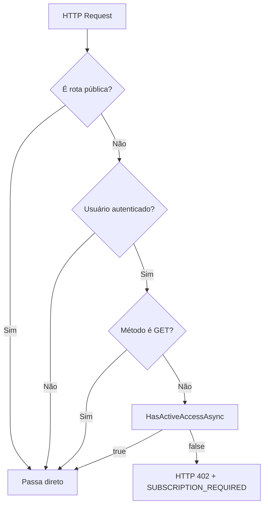
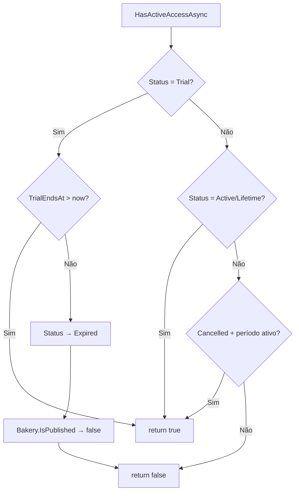
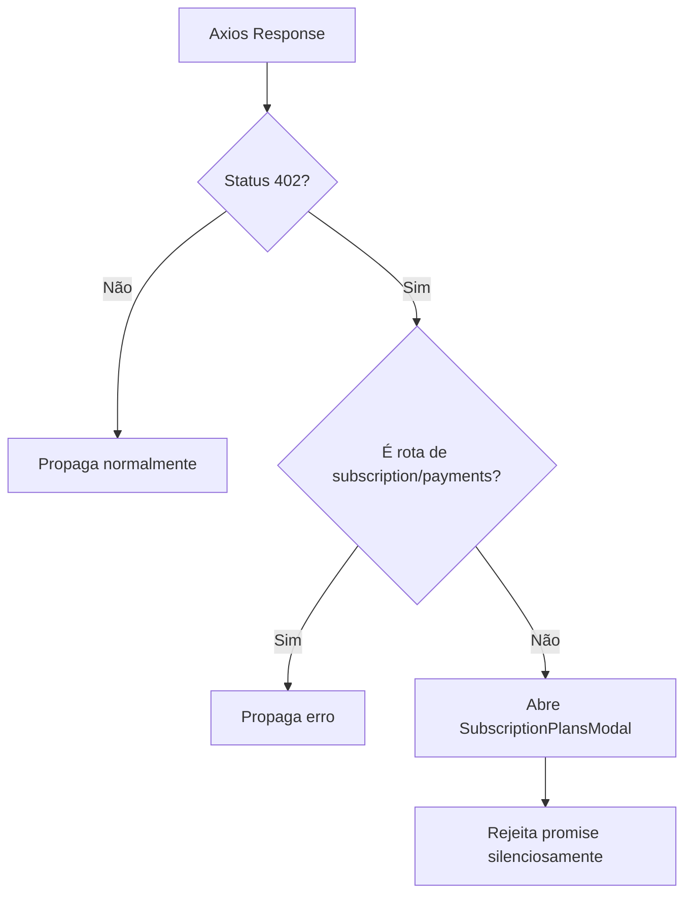
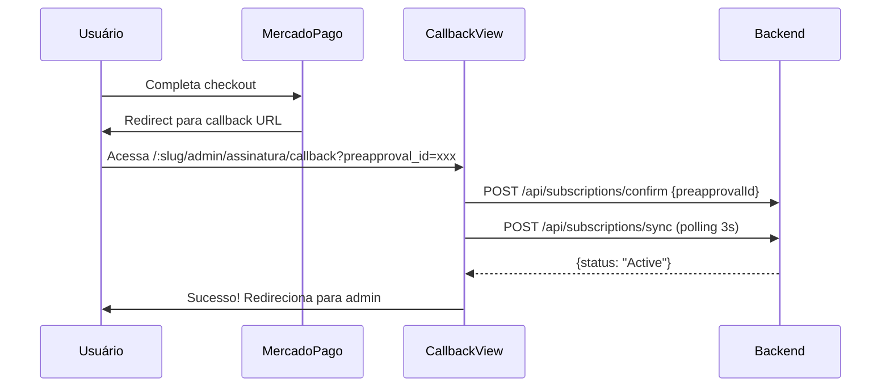
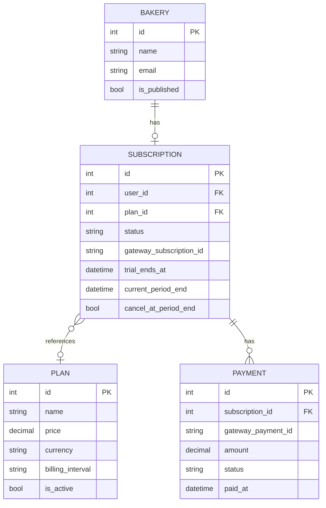

# Design Document: Subscription Plans

## Overview

Este design cobre a implementação completa do sistema de assinaturas para o Forizi Confeitaria. O backend de Billing já existe parcialmente (SubscriptionService, MercadoPagoGateway, IPaymentGateway, DTOs, repositório, controllers, modelos). Este design foca no que falta: middleware de bloqueio, efeitos colaterais de expiração, vitrine offline, frontend completo e integrações pendentes.

### Decisões de Design

1. **Middleware como ponto único de enforcement**: O `SubscriptionAccessMiddleware` centraliza a verificação de acesso, evitando checks espalhados em cada controller. Apenas métodos de escrita (POST/PUT/DELETE) são bloqueados — leitura permanece livre.

2. **Side-effects no service, não no middleware**: A despublicação da loja ao expirar acontece dentro do `HasActiveAccessAsync` e nos handlers de webhook, não no middleware. O middleware apenas bloqueia requests — efeitos colaterais ficam na camada de serviço.

3. **Frontend reativo via Pinia**: O `useSubscriptionStore` centraliza o estado da assinatura. O computed `hasFullAccess` é a fonte de verdade para todos os componentes. O interceptor 402 abre o modal de planos sem propagar o erro.

4. **Offline page no public store**: Quando a loja está despublicada, o backend retorna `{ offline: true, name }` em vez de 404. Isso permite exibir uma página amigável com o nome da confeitaria.

5. **Trial automático no registro**: O trial de 15 dias é criado fire-and-forget após o registro. Falha no trial não bloqueia o cadastro.

## Architecture

### Diagrama de Fluxo — Middleware de Bloqueio



### Diagrama de Fluxo — Expiração e Side-Effects



### Diagrama de Fluxo — Frontend 402 Interceptor



### Diagrama de Fluxo — Checkout Callback



## Components and Interfaces

### Backend — Novos Componentes

#### 1. SubscriptionAccessMiddleware

**Arquivo**: `backend/Shared/Middleware/SubscriptionAccessMiddleware.cs`

```csharp
public class SubscriptionAccessMiddleware(RequestDelegate next)
{
    private static readonly HashSet<string> PublicPrefixes =
    [
        "/api/auth",
        "/api/subscriptions",
        "/api/payments",
        "/health",
        "/swagger",
        "/api/public"
    ];

    public async Task InvokeAsync(HttpContext context, ISubscriptionService subscriptionService)
    {
        // GET sempre passa
        if (HttpMethods.IsGet(context.Request.Method))
        {
            await next(context);
            return;
        }

        // Rotas públicas passam
        var path = context.Request.Path.Value?.ToLowerInvariant() ?? "";
        if (PublicPrefixes.Any(prefix => path.StartsWith(prefix)))
        {
            await next(context);
            return;
        }

        // Sem usuário autenticado passa
        var userIdClaim = context.User.FindFirst(ClaimTypes.NameIdentifier)?.Value
                       ?? context.User.FindFirst(JwtRegisteredClaimNames.Sub)?.Value;
        if (string.IsNullOrEmpty(userIdClaim) || !int.TryParse(userIdClaim, out var userId))
        {
            await next(context);
            return;
        }

        // Verifica acesso
        if (!await subscriptionService.HasActiveAccessAsync(userId))
        {
            context.Response.StatusCode = 402;
            context.Response.ContentType = "application/json";
            await context.Response.WriteAsJsonAsync(new
            {
                message = "Assinatura inativa",
                code = "SUBSCRIPTION_REQUIRED"
            });
            return;
        }

        await next(context);
    }
}
```

**Decisão**: O `ISubscriptionService` é injetado via parâmetro do `InvokeAsync` (method injection) em vez do construtor, porque middlewares são singletons e o service é scoped.

#### 2. Alterações no HasActiveAccessAsync (SubscriptionService)

Adicionar side-effect de despublicação quando trial expira:

```csharp
public async Task<bool> HasActiveAccessAsync(int userId)
{
    // ... lógica existente ...
    if (subscription.Status == SubscriptionStatus.Trial)
    {
        var isTrialValid = subscription.TrialEndsAt.HasValue
            && subscription.TrialEndsAt.Value > BrazilDateTime.Now;

        if (!isTrialValid)
        {
            subscription.Status = SubscriptionStatus.Expired;
            await _repository.UpdateAsync(subscription);

            // NOVO: despublicar loja
            var bakery = await _repository.GetBakeryByIdAsync(userId);
            if (bakery != null && bakery.IsPublished)
            {
                bakery.IsPublished = false;
                await _repository.UpdateBakeryAsync(bakery);
            }
        }
        return isTrialValid;
    }
    // ...
}
```

#### 3. Alterações no StoreService.TogglePublishAsync

Verificar assinatura ativa antes de permitir publicação:

```csharp
public async Task<StoreSettingsDto> TogglePublishAsync(int bakeryId)
{
    var bakery = await bakeryRepository.GetByIdAsync(bakeryId)
        ?? throw new InvalidOperationException("Confeitaria não encontrada");

    if (!bakery.IsPublished)
    {
        // Quer publicar — verificar assinatura
        var hasAccess = await subscriptionService.HasActiveAccessAsync(bakeryId);
        if (!hasAccess)
            throw new InvalidOperationException("É necessário uma assinatura ativa para publicar a loja");
    }

    bakery.IsPublished = !bakery.IsPublished;
    await bakeryRepository.UpdateAsync(bakery);
    return MapToDto(bakery);
}
```

**Decisão**: `ISubscriptionService` será injetado no `StoreService` via construtor.

#### 4. Alterações no PublicController.GetStore

Retornar offline response em vez de 404 quando loja existe mas não está publicada:

```csharp
[HttpGet("{slug}")]
public async Task<ActionResult<PublicStoreDto>> GetStore(string slug)
{
    var bakery = await bakeryRepository.GetBySlugWithoutPublishFilterAsync(slug);

    if (bakery == null)
        return NotFound(new { message = "Loja não encontrada." });

    if (!bakery.IsPublished)
        return Ok(new { offline = true, name = bakery.Name });

    return Ok(new PublicStoreDto(/* ... */));
}
```

**Decisão**: Novo método no repositório `GetBySlugWithoutPublishFilterAsync` que busca por slug sem filtrar `IsPublished`. O método existente `GetBySlugAsync` já filtra por `IsPublished = true`.

#### 5. Integração do Trial no AuthService.RegisterAsync

```csharp
public async Task<LoginResponse> RegisterAsync(RegisterRequest request)
{
    // ... lógica existente de criação da bakery ...
    var created = await bakeryRepository.CreateAsync(bakery);

    // Criar trial — fire-and-forget, não bloqueia registro
    try
    {
        await subscriptionService.CreateTrialAsync(created.Id);
    }
    catch (Exception ex)
    {
        logger.LogError(ex, "Failed to create trial for bakery {BakeryId}", created.Id);
    }

    var token = JwtTokenHelper.GenerateToken(created, configuration);
    return new LoginResponse(token, JwtTokenHelper.MapToDto(created));
}
```

**Decisão**: `ISubscriptionService` e `ILogger<AuthService>` serão injetados no `AuthService` via primary constructor.

#### 6. Ajuste no MercadoPagoGateway

Alterar `reason` de `"Assinatura Meu Mês"` para `"Assinatura Forizi Confeitaria"`.

#### 7. Novo método no ISubscriptionRepository

```csharp
Task UpdateBakeryAsync(Bakery bakery);
Task<Bakery?> GetBakeryBySlugWithoutPublishFilterAsync(string slug);
```

### Frontend — Novos Componentes

#### 1. TypeScript Types

**Arquivo**: `frontend/src/types/subscription.ts`

```typescript
export interface SubscriptionPlan {
  id: number;
  name: string;
  price: number;
  currency: string;
  billingInterval: string;
}

export interface Subscription {
  id: number;
  status: SubscriptionStatus;
  trialEndsAt: string | null;
  currentPeriodEnd: string | null;
  cancelAtPeriodEnd: boolean;
  plan: SubscriptionPlan | null;
}

export type SubscriptionStatus =
  | 'Trial'
  | 'Active'
  | 'PastDue'
  | 'Cancelled'
  | 'Expired'
  | 'Lifetime'
  | 'Pending';

export interface SubscribeResponse {
  checkoutUrl: string;
  gatewaySubscriptionId: string;
}

export interface CancelSubscriptionRequest {
  reason: string;
  reasonText?: string;
}
```

#### 2. Subscription Service

**Arquivo**: `frontend/src/services/bakery/subscriptionService.ts`

```typescript
export const subscriptionService = {
  async getPlans(): Promise<SubscriptionPlan[]> { /* GET /subscriptions/plans */ },
  async getMySubscription(): Promise<Subscription> { /* GET /subscriptions/me */ },
  async subscribe(planId: number): Promise<SubscribeResponse> { /* POST /subscriptions/subscribe */ },
  async upgrade(planId: number): Promise<SubscribeResponse> { /* POST /subscriptions/upgrade */ },
  async cancel(request: CancelSubscriptionRequest): Promise<void> { /* POST /subscriptions/cancel */ },
  async sync(): Promise<Subscription> { /* POST /subscriptions/sync */ },
  async confirm(preapprovalId: string): Promise<Subscription> { /* POST /subscriptions/confirm */ },
};
```

#### 3. Subscription Store (Pinia)

**Arquivo**: `frontend/src/stores/bakery/subscription.ts`

```typescript
export const useSubscriptionStore = defineStore('bakery-subscription', () => {
  const subscription = ref<Subscription | null>(null);
  const plans = ref<SubscriptionPlan[]>([]);
  const loading = ref(false);

  const hasFullAccess = computed(() => {
    if (!subscription.value) return false;
    const s = subscription.value;
    if (s.status === 'Active' || s.status === 'Lifetime') return true;
    if (s.status === 'Trial' && s.trialEndsAt && new Date(s.trialEndsAt) > new Date()) return true;
    if (s.status === 'Cancelled' && s.currentPeriodEnd && new Date(s.currentPeriodEnd) > new Date()) return true;
    return false;
  });

  // Actions: loadSubscription, loadPlans, subscribe, upgrade, cancel, sync, confirm
});
```

**Decisão**: O computed `hasFullAccess` replica a lógica do backend `HasActiveAccessAsync` para feedback imediato no frontend. O backend permanece como fonte de verdade.

#### 4. SubscriptionPlansModal

**Arquivo**: `frontend/src/components/SubscriptionPlansModal.vue`

Modal Vuetify com `v-dialog`. Exibe planos com nome, preço, intervalo e botão de assinar. Quando o usuário tem assinatura mensal ativa, exibe opção de upgrade para anual. Ao clicar em assinar, chama `subscriptionStore.subscribe(planId)` e redireciona para `checkoutUrl` via `window.location.href`.

O modal é controlado por um ref exportado globalmente para ser aberto pelo interceptor 402.

#### 5. SubscriptionCallbackView

**Arquivo**: `frontend/src/views/bakery/SubscriptionCallbackView.vue`

Rota: `/:slug/admin/assinatura/callback`

Extrai `preapproval_id` dos query params. Chama `confirm`, depois faz polling de `sync` a cada 3s por até 30s. Exibe loading durante polling, sucesso quando ativa, ou mensagem de processamento quando timeout.

#### 6. SubscriptionBanner

**Arquivo**: `frontend/src/components/bakery/SubscriptionBanner.vue`

Componente `v-alert` renderizado no `BakeryAdminLayout`. Lógica:
- Trial: azul, "X dias restantes" (laranja se ≤ 3 dias)
- Active: info com plano e próxima cobrança
- Cancelled + período ativo: warning com data de fim
- Expired/Cancelled sem período: error com botão para abrir modal
- Lifetime: não renderiza

#### 7. Interceptor 402

Adicionado ao interceptor existente em `api.ts`. Quando recebe 402 e a URL não é de `/subscriptions` ou `/payments`, abre o `SubscriptionPlansModal` e rejeita a promise sem propagar.

#### 8. StoreOfflineView

**Arquivo**: `frontend/src/views/store/StoreOfflineView.vue`

Card centralizado com ícone `mdi-store-off-outline`, nome da confeitaria, mensagem "Esta loja está temporariamente fora do ar" e "Volte em breve". Usa variáveis CSS do design system.

#### 9. Alterações no PublicStore e StoreLayout

O `publicStore.load()` passa a detectar `offline: true` na response e setar um ref `offline`. O `StoreLayout` renderiza `StoreOfflineView` quando offline, escondendo navegação.

## Data Models

### Modelos Existentes (sem alteração)

Os modelos `Plan`, `Subscription`, `Payment`, `SubscriptionStatus` e `BillingInterval` já existem em `backend/Shared/Models/` e estão corretos para esta feature.

### Seed Data — Atualização de Preços

Os planos no seed precisam ser atualizados para os preços corretos:

```
Plan 1: "Mensal"  → R$ 29,90  (Monthly)
Plan 2: "Anual"   → R$ 299,90 (Yearly)
```

Atualmente o seed tem R$ 14,90 e R$ 149,90. Será necessária uma migration para atualizar os valores.

### Novo Método no Repository

```csharp
// ISubscriptionRepository — adicionar:
Task UpdateBakeryAsync(Bakery bakery);

// IBakeryRepository — adicionar:
Task<Bakery?> GetBySlugWithoutPublishFilterAsync(string slug);
```

### Diagrama ER (existente)



## Correctness Properties

*A property is a characteristic or behavior that should hold true across all valid executions of a system — essentially, a formal statement about what the system should do. Properties serve as the bridge between human-readable specifications and machine-verifiable correctness guarantees.*

### Property 1: Middleware access control

*For any* HTTP request with any combination of method (GET/POST/PUT/DELETE), route path, and subscription status (Trial, Active, Expired, Cancelled, Lifetime, Pending, anonymous), the middleware SHALL:
- Allow the request if the method is GET
- Allow the request if the path matches a public route prefix
- Allow the request if there is no authenticated user
- Allow the request if the subscription is active (Active, Lifetime, valid Trial, Cancelled with future period)
- Return HTTP 402 otherwise (POST/PUT/DELETE on non-public route with inactive subscription)

**Validates: Requirements 1.1, 1.3, 1.4, 1.5, 2.4**

### Property 2: Subscription deactivation unpublishes bakery

*For any* bakery with `IsPublished = true` and a subscription that transitions to an inactive state (Trial → Expired when TrialEndsAt has passed, or Active/Cancelled → Expired/Cancelled when CurrentPeriodEnd has passed), calling `HasActiveAccessAsync` or processing a webhook SHALL set `Bakery.IsPublished` to false.

**Validates: Requirements 2.1, 2.2**

### Property 3: Publish requires active subscription

*For any* bakery with an inactive subscription (Expired, Cancelled without remaining period, Pending), attempting to set `IsPublished` to true via `TogglePublishAsync` SHALL be rejected with an error. Conversely, for any bakery with an active subscription, publishing SHALL succeed.

**Validates: Requirements 2.3**

### Property 4: hasFullAccess computed correctness

*For any* Subscription object with any combination of status (Trial, Active, Cancelled, Expired, Lifetime, Pending, PastDue), trialEndsAt (past/future/null), and currentPeriodEnd (past/future/null), the `hasFullAccess` computed SHALL return true if and only if:
- status is Active or Lifetime, OR
- status is Trial and trialEndsAt is in the future, OR
- status is Cancelled and currentPeriodEnd is in the future

**Validates: Requirements 5.2**

## Error Handling

### Backend

| Cenário | Comportamento | HTTP Status |
|---------|--------------|-------------|
| Assinatura inativa + escrita | Middleware retorna 402 | 402 |
| Publicar loja sem assinatura ativa | StoreService rejeita | 400 |
| Trial creation falha no registro | Log error, continua registro | N/A (fire-and-forget) |
| Gateway falha ao criar assinatura | SubscriptionService propaga exceção | 400 |
| Gateway falha ao cancelar | Verifica status real no gateway, atualiza se já cancelado | 400 |
| Webhook com payload inválido | Log warning, retorna 200 | 200 |
| Webhook com subscription não encontrada | Log warning, retorna 200 | 200 |
| Slug não encontrado (público) | Retorna 404 | 404 |
| Slug existe mas loja offline | Retorna 200 com `{ offline: true }` | 200 |

### Frontend

| Cenário | Comportamento |
|---------|--------------|
| Resposta 402 em qualquer endpoint (exceto subscription/payments) | Abre SubscriptionPlansModal, não propaga erro |
| Resposta 402 em endpoint de subscription/payments | Propaga erro normalmente |
| Polling timeout no callback | Exibe mensagem "pagamento sendo processado" |
| Falha ao carregar planos | notify.error, mantém modal aberto |
| Falha ao carregar subscription | notify.error, `subscription = null` |
| Redirect para checkout falha | notify.error com mensagem do backend |

## Testing Strategy

### Abordagem Dual

- **Unit tests**: Cenários específicos, edge cases, error conditions
- **Property tests**: Propriedades universais que devem valer para todas as combinações de input

### Backend — Unit Tests

1. **SubscriptionAccessMiddleware**: Testar cada combinação de método/rota/status com exemplos concretos
2. **HasActiveAccessAsync side-effects**: Verificar despublicação ao expirar trial
3. **TogglePublishAsync**: Verificar bloqueio quando assinatura inativa
4. **AuthService.RegisterAsync**: Verificar criação de trial e resiliência a falhas
5. **MercadoPagoGateway**: Verificar reason string atualizada
6. **Webhook handlers**: Verificar transições de status e side-effects

### Backend — Property Tests

Usar **FsCheck** (biblioteca PBT para .NET) com xUnit:

- **Property 1**: Gerar combinações aleatórias de (HttpMethod, RoutePath, SubscriptionStatus, IsAuthenticated). Verificar que o middleware retorna o status code correto.
  - Tag: `Feature: subscription-plans, Property 1: Middleware access control`
  - Mínimo 100 iterações

- **Property 2**: Gerar bakeries com IsPublished=true e subscriptions com status Trial/Active/Cancelled e datas variadas. Chamar HasActiveAccessAsync e verificar que IsPublished é false quando subscription fica inativa.
  - Tag: `Feature: subscription-plans, Property 2: Subscription deactivation unpublishes bakery`
  - Mínimo 100 iterações

- **Property 3**: Gerar subscription statuses aleatórios. Chamar TogglePublishAsync em bakeries não publicadas. Verificar que só permite publicar com subscription ativa.
  - Tag: `Feature: subscription-plans, Property 3: Publish requires active subscription`
  - Mínimo 100 iterações

### Frontend — Property Tests

Usar **fast-check** (biblioteca PBT para TypeScript) com Vitest:

- **Property 4**: Gerar objetos Subscription aleatórios com status, trialEndsAt e currentPeriodEnd variados. Verificar que hasFullAccess retorna o valor correto.
  - Tag: `Feature: subscription-plans, Property 4: hasFullAccess computed correctness`
  - Mínimo 100 iterações

### Frontend — Unit Tests

1. **SubscriptionPlansModal**: Renderização de planos, clique em assinar, opção de upgrade
2. **SubscriptionBanner**: Cada variação de status (trial, active, cancelled, expired, lifetime)
3. **SubscriptionCallbackView**: Polling behavior, success, timeout
4. **Interceptor 402**: Abertura do modal, exclusão de rotas de subscription
5. **StoreOfflineView**: Renderização com nome da confeitaria
6. **StoreLayout**: Renderização condicional quando offline

### Frontend — Integration Tests

1. **PublicStore + StoreLayout**: Fluxo completo de detecção offline e renderização
2. **SubscriptionStore**: Fluxo completo de loadSubscription → hasFullAccess

